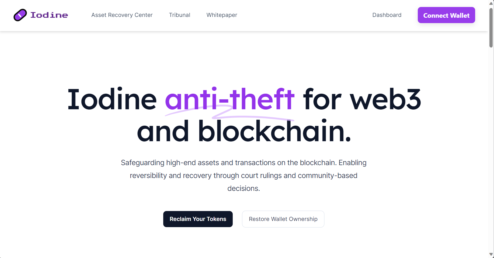

# Iodine 


### ✨ Introduction

Iodine ($IDN) is a cutting-edge platform poised to revolutionize the blockchain ecosystem. Drawing inspiration from the purifying properties of its namesake element, Iodine offers an approach to decentralized finance that blends security, fairness, and innovative reversibility.

## Demo & Resources

🔗 **Live Demo**: [Iodine Demo](https://iodine-dapp.vercel.app/)  

🌟 **Video Walkthrough**: [See what we built](#Walkthrough-Video-Link-Here)  - coming very very soon

Please feel free to contact us [here](mailto:tolugbesan@gmail.com)



### 🖥️ Platform Overview

Blockchain, with its inherent immutability, offers unparalleled trust but can also leave room for misuse. Iodine ($IDN) challenges this by integrating the possibility of reversible transactions, fortified by the most recent technological advancements.


#### Key Components

1. **Token Contract**:
   - The primary token for the platform, serving as the main medium of exchange and value.

2. **Iodine Contract**:
   - Possesses the capability to freeze accounts to safeguard assets.
   - Features to report and redress theft or unauthorized transactions.

3. **Tribunal Contract**:
   - Implements the Mech NFTs (ERC-6551) to symbolize theft cases.
   - Each NFT, named "Tribunal", represents a live legal contention regarding stolen funds.
   - The contested funds are securely held within the Tribunal NFT until a legal conclusion is achieved.

#### Smart Contract Functions & Integrations

1. **Iodine Contract**:
   - `reportOwnershipTheft`: Upholds individual ownership rights, initiating a process to secure assets upon theft report.
   - `reportTokenTheft`: Activates mechanisms to identify unauthorized token transactions and immobilizes them.
   - `reportAssetTheft`: Comprehensive feature for extensive asset protection, ranging from tokens to other blockchain commodities.

2. **Tribunal Contract**:
   - Houses the Mech NFTs operating under the ERC-6551 standard. These specialized smart contract wallets are tied to each distinct ERC-721 NFT.
   - On theft report within Iodine, a Tribunal NFT is generated. This NFT serves a dual purpose: it symbolizes the theft case and functions as a protective vault for the disputed funds.
   - The integration with the Iodine Contract ensures a streamlined reporting and resolution process.


#### Architecture Options

1. **Separate Contracts with Interfacing**:
   - The Iodine and Tribunal Contracts function as distinct entities, offering more flexibility and enabling individual upgrades without affecting the counterpart.
   - The Iodine Contract can interface with the Tribunal Contract during theft reports.

2. **Nested or Facilitated by Iodine Contract**:
   - The functionalities of the Tribunal NFTs could be embedded within the Iodine Contract, providing simplicity but potential complexity if too many functions accumulate.

### 🎉 Conclusion

Iodine ($IDN) represents more than a mere platform; it symbolizes a paradigm shift in the blockchain world. By seamlessly integrating community decisions, legal oversight, and avant-garde technologies like the Tribunal NFTs, Iodine establishes a new benchmark for a balanced, secure, and forward-thinking blockchain ecosystem.

---

### 🔧 Installation

1. Clone the project:
    ```bash
   git clone https://github.com/IthriHQ/iodine.git
   ```

2. Install the necessary dependencies:
   ```bash
   cd iodine
   npm install
   ```
   
3. To run smart contract locally use the following commands:

    ```bash
    npx hardhat node
    npx hardhat run scripts/deploy.ts
    ```
    
4. To run frontend app use the following commands:

    ```bash
    cd iodine-frontend
    npm install
    npm run dev
    ```

NOTE: Request for .env variables from Team lead

### 🌟 Contribution Guidelines

To contribute to the project, please follow these steps:

1. Clone the repository to your local machine:
   ```bash
   git clone https://github.com/IthriHQ/name-of-project.git
   cd name-of-project
   ```

2. Pull the latest changes from the `develop` branch to ensure you have the most up-to-date code:
   ```bash
   git checkout develop
   git pull origin develop
   ```

3. Create a new feature branch for your contribution. It's recommended to name the branch descriptively:
   ```bash
   git checkout -b feature/descriptive-branch-name
   ```

4. Make your changes and commit them to the feature branch:
   ```bash
   git add .
   git commit -m "Add your descriptive commit message here"
   ```

5. Push your feature branch to the remote repository on GitHub:
   ```bash
   git push origin feature/descriptive-branch-name
   ```

6. Go to the repository on GitHub and click on the "Compare & pull request" button for your feature branch.

7. Add a title and description for your pull request, outlining the changes you made and any relevant information.

8. Request a review from team members or the Team Lead by mentioning them in the pull request description using `@username`.

9. Once your pull request has been reviewed and approved, it will be merged into the `develop` branch.

10. Congratulations on your contribution! Your changes are now part of the project.
